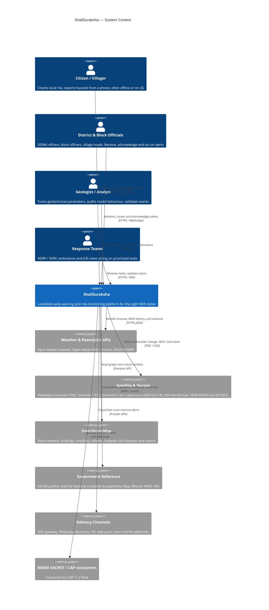
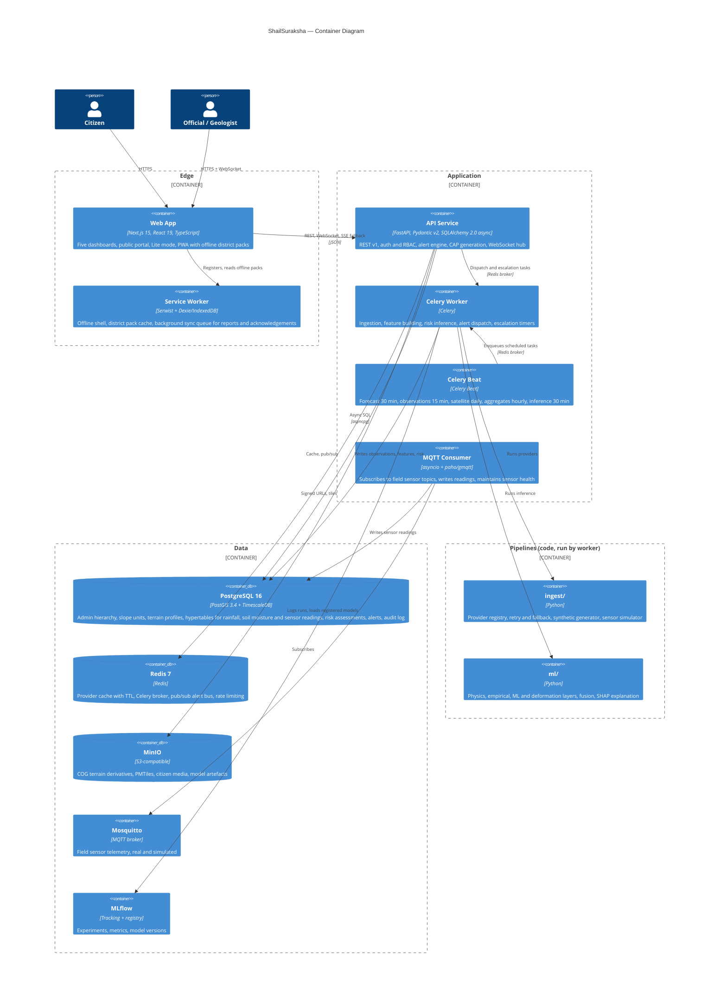
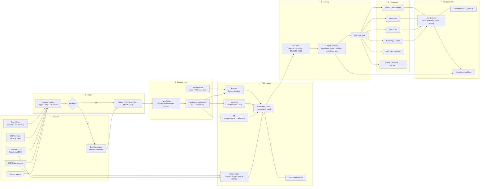
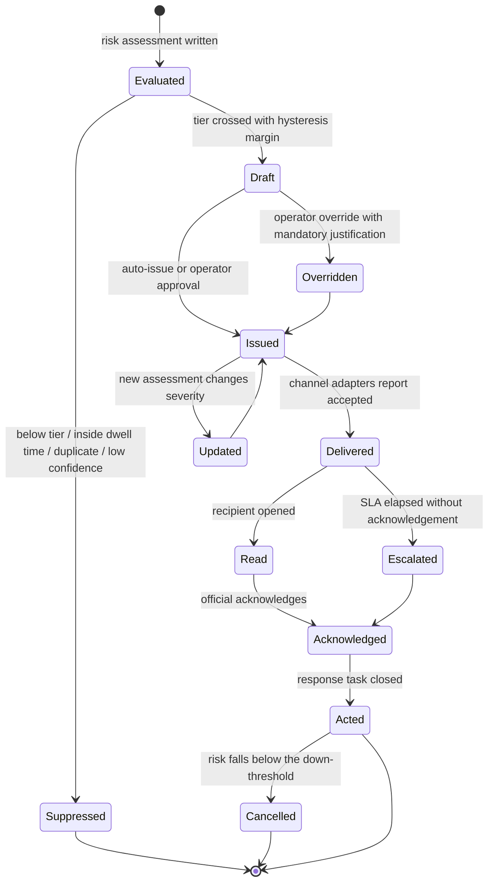
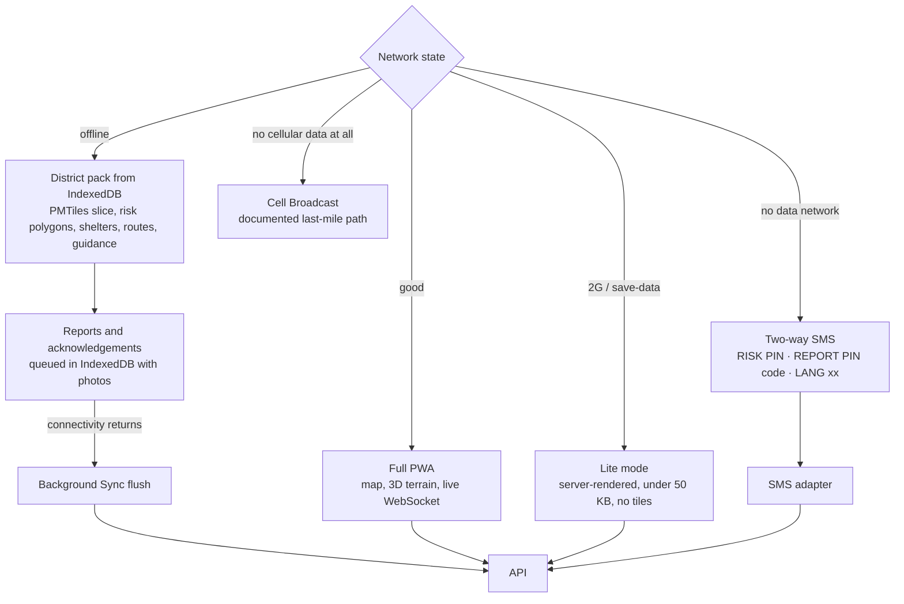
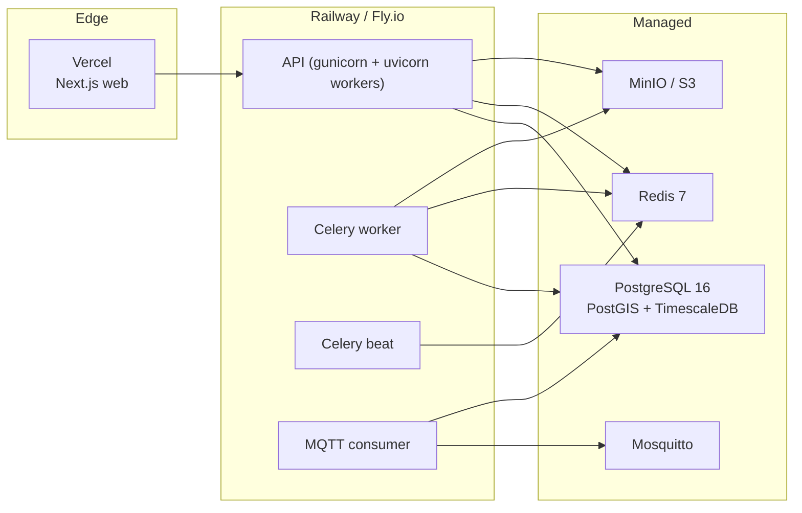

# ShailSuraksha — Architecture

Status: Phase 0 (foundation). This document describes the target architecture. Components
that do not yet exist in code are marked **(planned, Phase N)** so the diagram never
overstates what is built.

---

## 1. Design principles

1. **Every number is traceable.** A risk probability on screen can be walked back through
   fusion → its three component layers → the features → the source record → the provider
   and its fetch timestamp. This is what survives the "why should I trust this number"
   question.
2. **Degrade, never lie.** Any provider can fail. When it does, the system falls back to
   cache and then to the synthetic engine, and the UI says so with a per-source chip.
3. **The slope unit is the atomic object.** Risk is computed on hydrologically derived
   slope polygons, not on grid cells and not on administrative units. Administrative
   aggregates are derived upward from slope units for reporting.
4. **Accountability is a first-class feature.** Alerts have a lifecycle with
   acknowledgements and escalation, and every state change writes an immutable audit row.
5. **The last mile is the product.** Offline packs, Lite mode, SMS and IVR are not
   fallbacks bolted on at the end; they are the delivery path for the users who most need
   the warning.

---

## 2. C4 Level 1 — System context

## 3. C4 Level 2 — Containers

## 4. Data flow — source to acknowledgement

The spine of the system. Read left to right; each arrow is a place where provenance is
recorded.

### Provenance contract

Every `RiskAssessment` row carries `model_version` and an `explanation_json` that names
the source records and the fetch status behind each feature. A user drilling into a score
sees the provider, its status chip and the age of the data that produced it. If any input
was `SIMULATED`, the assessment is flagged as such all the way to the alert.

## 5. Alert lifecycle

Every transition writes an `AuditLog` row with actor, action, target, before and after
state, IP address and timestamp. `Suppressed` is audited too, because "why was I not
warned" is as important a question as "why was I warned".

## 6. Offline and degraded-network path

## 7. Deployment topology

Local development runs the identical set through `infra/docker-compose.yml`, so the only
difference between a laptop and the deployed system is where the managed services live.

## 8. Key architectural risks

| Risk | Impact | Mitigation | Phase to resolve |
|---|---|---|---|
| deck.gl v9 and MapLibre v5 interop via `MapboxOverlay` | The signature visual fails | Version-pin and spike early in the map phase before building layers on top | 5–6 |
| Risk recomputation for the whole NER exceeding the 90 s budget | The what-if simulator stops feeling live | Vectorise with numpy and xarray over slope-unit arrays instead of per-unit loops; profile from the first implementation | 3, 7 |
| Slope-unit delineation producing too few or too many polygons | Either coarse risk or an unusable map | Target 8,000–20,000 units, tune the drainage threshold, and report the actual count | 1 |
| Geotechnical parameters being effectively guesses | A geologist judge can dismantle the FoS claim | Keep parameters in an editable, sourced, per-lithology table and show sensitivity ranges rather than false precision | 3 |
| Provider rate limits or outages during the live demo | The demo appears broken | Pre-warmed Redis cache, deterministic synthetic fallback, and honest status chips | 2 |
| Translation quality for low-resource languages | The core equity claim weakens | Record every reviewer and mark machine-translated strings explicitly | 9 |

## 9. What exists today (end of Phase 0)

Built: the monorepo skeleton, the documentation set, Docker Compose for the full local
stack, the Makefile and its PowerShell mirror, CI, and the Next.js application shell with
the design tokens, the theme toggle and next-intl wiring.

Not yet built: everything inside the pipelines and the risk engine. Phases 1 through 11
in `PROJECT_CONTEXT.md` §16 fill them in, in that order.
